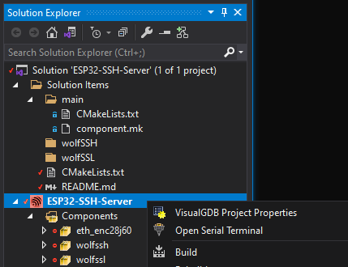

# ESP32 SSH Server

Connect to Tx/Rx pins on [Espressif ESP32](https://docs.espressif.com/projects/esp-idf/en/latest/esp32/hw-reference/index.html)
UART via remote SSH. 
There's also an [ESP8266 Version](https://github.com/gojimmypi/wolfssh/tree/ESP8266_Development/examples/ESP8266-SSH-Server#readme).
 
This particular example utilizes the sample application for the [Espressif Wired ENC28J60 Ethernet](https://github.com/espressif/esp-idf/tree/master/examples/ethernet/enc28j60) 
as well as the [Getting Started - Wi-Fi Station Example](https://github.com/espressif/esp-idf/tree/master/examples/wifi/getting_started/station)
and includes the [wolfSSH library](https://github.com/wolfssl/wolfssh) from [wolfSSL](https://www.wolfssl.com/). 
Additional information is available in [wolfSSL INSTALL](https://github.com/wolfSSL/wolfssl/blob/master/INSTALL).

See [tweet thread](https://twitter.com/gojimmypi/status/1510703484886085633?s=20&t=SuiFcn672jlhXtCVh0lRRw).

There's an [ESP-IDF wolfSSH component install in IDE/Espressif/ESP-IDF](https://github.com/wolfSSL/wolfssh/blob/master/ide/Espressif/ESP-IDF/setup_win.bat) for Windows. 
and [an install for Linux](https://github.com/wolfSSL/wolfssh/blob/master/ide/Espressif/ESP-IDF/setup.sh).

See also the related [ESP-IDF wolfSSL component install](https://github.com/wolfSSL/wolfssl/tree/master/IDE/Espressif/ESP-IDF) for both Windows and bash scripts 
as well as the [wolfcrypt port to Espressif](https://github.com/wolfSSL/wolfssl/blob/master/wolfcrypt/src/port/Espressif/README.md).

[wolfSSL ESP32 Hardware Acceleration Support](https://www.wolfssl.com/wolfssl-esp32-hardware-acceleration-support/)
<br />

## Linux Quick Start

This project does not yet work with ESP-IDF Version 5.x.

```
#!/bin/bash

# Make sure you re-login to enable read and write permissions for the serial port.
sudo usermod -a -G dialout $USER

# get ESP-IDF version 4.1.1
mkdir -p ~/esp
cd ~/esp
git clone -b v4.4.1 --recursive https://github.com/espressif/esp-idf.git --depth 1

cd ~/esp/esp-idf
./install.sh esp32

. ./export.sh

# get wolfssl and wolfssh
mkdir -p ~/workspace
cd ~/workspace
git clone --recursive https://github.com/wolfssl/wolfssl.git --depth 1
git clone --recursive https://github.com/wolfssl/wolfssh.git --depth 1

git clone -b ESP32_Development https://github.com/gojimmypi/wolfssh.git wolfssh-gojimmypi --depth 1

cd ~/workspace/wolfssl/IDE/Espressif/ESP-IDF
./setup.sh

cd ~/workspace/wolfssh/ide/Espressif/ESP-IDF
./setup.sh

cd ~/workspace/wolfssh-gojimmypi/examples/ESP32-SSH-Server
idf.py build

idf.py -p /dev/ttyUSB0 flash

```

config files needed:

```
components/wolfssh/include/user_settings.h
components/wolfssl/include/user_settings.h
components/wolfssl/wolfssl/options.h
```


## Requirements

[ESP-IDF Version 4.x](https://docs.espressif.com/projects/esp-idf/en/v4.4.1/esp32/index.html)

Any ESP32 with available UART pins other than USB / Console. The default is 
`U2TXD` = `TXD_PIN` = `GPIO_NUM_17` 
and 
`U2RXD` = `RXD_PIN` = `GPIO_NUM_16`
defined in the [main/ssh_server_config.h](./main/ssh_server_config.h) file.

Although there's no notion of a "speed" setting in SSH, our UART bridge needs to have one set.
The `BAUD_RATE` for the target board is defined in [main/ssh_server_config.h](./main/ssh_server_config.h) 
and is typically:  `#define BAUD_RATE (57600)`. 
Serial port console monitoring port is typically 74800 baud, 8N1.

For more details on the UARTs and the ESP32 in general, refer to the 
[ESP32 Technical Reference Manual](https://www.espressif.com/sites/default/files/documentation/esp32_technical_reference_manual_en.pdf)
<br />

## Private Config

It is usually best to not publish private SSID names and passwords to GitHub. 
As such the project [CMakeLists.txt](./CMakeLists.txt) looks for one of these files, in this order:

```
# VisualGDB default
/c/workspace/my_private_config.h

# Windows 
/workspace/my_private_config.h

# WSL
/mnt/c/workspace/my_private_config.h

# Linux
~/my_private_config.h
```
If no `my_private_config.h` file is found, default values are used. See [my_config.h](./main/my_config.h)
<br />

## Building

The [project](https://github.com/gojimmypi/wolfssh/blob/ESP32_Development/examples/ESP32-SSH-Server/ESP32-SSH-Server.vgdbproj) 
was developed in Visual Studio with the [Sysprogs VisualGDB](https://visualgdb.com/) extension.
Just open the solution file in the [examples/ESP32-SSH-Server](https://github.com/gojimmypi/wolfssh/tree/ESP32_Development/examples/ESP32-SSH-Server) directory. 
Right-click the project and "Build...":



Alternatively, the code can be built via the [ESP-IDF for ESP32](https://docs.espressif.com/projects/esp-idf/en/latest/esp32/index.html).

VisualGDB will typically use the `sdkconfig-debug` (and possibly `sdkconfig-release`), 
but the ESP-IDF commandline will use `sdkconfig`.

Note for wired ethernet, the ENC28J60 component make not be available in some versions of the ESP-IDF. See below: [Wired Ethernet Notes](#wired-ethernet-enc28j60-notes).

<br />

## ESP32 Toolchain

This section is only needed for users not using VisualGDB. Otherwise, see the [VisualGDB Tutorials](https://visualgdb.com/w/tutorials/tag/esp32/).

This project does not yet work with ESP-IDF Version 5.x.

Install Version 4.4 of [ESP32 ESP-IDF](https://docs.espressif.com/projects/esp-idf/en/release-v4.4/esp32/get-started/index.html). 

*NOTE:* This project has NOT yet been migrated to Version 5.0 ofthe ESP-IDF. 
See the [Migration Guide](https://docs.espressif.com/projects/esp-idf/en/latest/esp32/migration-guides/build-system.html)

To use a dual Windows/Linux (WSL) option, consider a shared directory such as `C:\ESP32\esp\`
which would be `/mnt/c/ESP32/esp/` in WSL.

Note there may be an old version of wolfSSL in `ESP32\components\esp-wolfssl` that should be deleted.

Windows/DOS 

Note the `IDF_PATH` may alrteady be set if calling from the installed shortcut 
(typically in `C:\Users\%USERNAME%\.espressif\idf_cmd_init.bat`)

```batch
SET IDF_PATH=C:\Users\%username%\Desktop\esp-idf
SET WORKSPACE=C:\workspace
```
WSL

```bash
export IDF_PATH=/mnt/c/Users/$USER/Desktop/esp-idf
export WORKSPACE=/mnt/c/workspace
```

Linux

```bash
export IDF_PATH=~/esp-idf
export WORKSPACE=~/workspace
```
<br />

## Configuration

See the [ssh_server_config.h](./main/ssh_server.h) files for various configuration settings.

For a wired ethernet connection, see `#define USE_ENC28J60`. When not defined, WiFi is assumed.

Currently 3 specific target boards confirmed to be working: 
a default [ESP32-WROOM board](https://www.espressif.com/en/producttype/esp32-wroom-32), 
the [Radiona ULX3S](https://www.crowdsupply.com/radiona/ulx3s), 
and the [M5Stack Stick-C](https://shop.m5stack.com/products/stick-c) 

```
#undef ULX3S
#undef M5STICKC
#ifdef M5STICKC
    /* reminder GPIO 34 to 39 are input only */
    #define TXD_PIN (GPIO_NUM_26) /* orange */
    #define RXD_PIN (GPIO_NUM_36) /* yellow */
#elif ULX3S
    /* reminder GPIO 34 to 39 are input only */
    #define TXD_PIN (GPIO_NUM_32) /* orange */
    #define RXD_PIN (GPIO_NUM_33) /* yellow */
#else
    #define TXD_PIN (GPIO_NUM_17) /* orange */
    #define RXD_PIN (GPIO_NUM_16) /* yellow */
#endif
```

#### RSA

RSA is disabled for this project. RSA is enabled unless otherwise specified.

To enable RSA, remove both definitions `WOLFSSH_NO_RSA` and `NO_RSA` at compile time. See the [main/CMakeLists.txt](./main/CMakeLists.txt):

```
set(CMAKE_C_FLAGS "${CMAKE_C_FLAGS} -DWOLFSSL_USER_SETTINGS -DWOLFSSH_NO_RSA -DNO_RSA")
```

<br />

## Defaults

The default users and passwords are the same as in the [linux server.c example](https://github.com/wolfSSL/wolfssh/blob/8a714b2864e6b5c623da2851af5b5c2d0f9b186b/examples/server/server.c#L412):

User: `jill` password: `upthehill`
User: `jack` password: `fetchapail`

When using ECC or RSA keys, the users are `hansel` and `gretel`. (see `samplePublicKeyEccBuffer`)

When in AP mode, the demo SSID is `TheBucketHill` and the wifi password is `jackorjill`. 
Unlike the STA mode, where the device needs to get an IP address from DHCP, in AP mode
the IP address is `192.168.4.1`. The computer connecting will likely get an address of `192.168.4.2`.
See the [main/ssh_server_config.h](./main/ssh_server_config.h) 
to define `WOLFSSH_SERVER_IS_AP` or `WOLFSSH_SERVER_IS_STA`.

The default SSH port for this demo is `22222` and is defined in [main/ssh_server_config.h](./main/ssh_server_config.h).


<br />

## Connecting

Example to connect from Linux with a password:

```bash
ssh jill@192.168.75.39 -p 22222
```

If the SSH Server is configured for RSA Algorithm but you've turned that off in favor
or more modern and secure algoritems, you'll need to use something like this to connect:

```bash
ssh -o"PubkeyAcceptedAlgorithms +ssh-rsa" -o"HostkeyAlgorithms +ssh-rsa" -p22222 jill@192.168.4.2
```

When using ecc, this sanmple app uses the key `static const unsigned char ecc_key_der_256[]` found 
in [components/wolfssh/wolfssh/certs_test.h](./components/wolfssh/wolfssh/certs_test.h)
See `load_key()` in [main/ssh_server.c](./main/ssh_server.c). See also the sample keys in 
[wolfssl/certs_test.h](https://github.com/wolfSSL/wolfssl/blob/master/wolfssl/certs_test.h) which are
[generated](https://github.com/wolfSSL/wolfssl/blob/master/scripts/dertoc.pl) from
[wolfssl/certs](https://github.com/wolfSSL/wolfssl/tree/master/certs)

There's currently no capability of saving new user keys, so `ssh-copy-id` will not work.

Linux users note [this resource](http://sensornodeinfo.rockingdlabs.com/blog/2016/01/19/baud74880/) may be helpful for connecting at 74800 baud:

```bash
git clone https://gist.github.com/3f1a984533556cf890d9.git anybaud
cd anybaud
gcc gistfile.c -o anybaud
anybaud /dev/ttyUSB0 74880
```
<br />

## Quick Start

For convenience ONLY, there's a [static copy of wolfSSL components](https://github.com/gojimmypi/wolfssh/tree/ESP32_Development/examples/ESP32-SSH-Server/components/).

DO NOT USE those static components for anything other than this demo. 
At some point, the code could contain critical, unresolved CVEs that are fixed 
in the current release. To ensure robust security,
install recent code into the Espressif components directory and 
delete your local copy found in `examples/ESP32-SSH-Server/components/`

WSL Quick Start

```bash
# change to whatever directory you use for projects

if [ "$WORKSPACE"    == "" ]; then read -p "WORKSPACE not set?"; fi
cd $WORKSPACE

git clone https://github.com/gojimmypi/wolfssh.git
cd ./wolfssh
git checkout ESP32_Development
cd ./examples/ESP32-SSH-Server

# Reminder that WSL USB devices are called /dev/ttySn and not /dev/TTYUSBn
# For example, on Windows, COM15 is ttyS15 in WSL.
idf.py -p /dev/ttyS15 -baud 460800 flash

```
<br />

## Wired Ethernet ENC28J60 Notes

The Espressif ENC28J60 library may not be included in the [components/esp_eth/include](https://github.com/espressif/esp-idf/tree/master/components/esp_eth/include) directory,
depending on the latest release install, but the [example component](https://github.com/espressif/esp-idf/tree/master/examples/ethernet/enc28j60/components/eth_enc28j60) 
can be copied to the ESP-IDF.

The earliest release that [includes that directory is Version 4.4](https://github.com/espressif/esp-idf/tree/release/v4.4/examples/ethernet/enc28j60/components/eth_enc28j60). 

The [CMakeLists.txt](./CMakeLists.txt) should be able to copy the components when running `cmake .` in the project directory. Otherwise, the files may need to be manually copied 
to the local ESP-IDF `components` directory.

Note some early versions may not properly get an IP address, so it is best to use the most recent even if the files need to be manually copied into an older ESP-IDF.

## Operational Status

Unlike the ESP8266 that needs to have a [shell game of UARTs](https://gojimmypi.github.io/SSH-to-ESP8266/), 
the ESP32 is much more graceful. The console port at boot time should look like this:
<br />

```text
ets Jun  8 2016 00:22:57

rst:0x1 (POWERON_RESET),boot:0x17 (SPI_FAST_FLASH_BOOT)
configsip: 0, SPIWP:0xee
clk_drv:0x00,q_drv:0x00,d_drv:0x00,cs0_drv:0x00,hd_drv:0x00,wp_drv:0x00
mode:DIO, clock div:2
load:0x3fff0030,len:6628
load:0x40078000,len:14780
load:0x40080400,len:3792
entry 0x40080694
I (26) boot: ESP-IDF v4.4-263-g000d3823bb-dirty 2nd stage bootloader
I (26) boot: compile time 20:42:35
I (26) boot: chip revision: 1
I (31) boot_comm: chip revision: 1, min. bootloader chip revision: 0
I (38) boot.esp32: SPI Speed      : 40MHz
I (43) boot.esp32: SPI Mode       : DIO
I (47) boot.esp32: SPI Flash Size : 4MB
I (52) boot: Enabling RNG early entropy source...
I (57) boot: Partition Table:
I (61) boot: ## Label            Usage          Type ST Offset   Length
I (68) boot:  0 nvs              WiFi data        01 02 00009000 00006000
I (75) boot:  1 phy_init         RF data          01 01 0000f000 00001000
I (83) boot:  2 factory          factory app      00 00 00010000 00100000
I (90) boot: End of partition table
I (95) boot_comm: chip revision: 1, min. application chip revision: 0
I (102) esp_image: segment 0: paddr=00010020 vaddr=3f400020 size=1d850h (120912) map
I (154) esp_image: segment 1: paddr=0002d878 vaddr=3ffb0000 size=027a0h ( 10144) load
I (158) esp_image: segment 2: paddr=00030020 vaddr=400d0020 size=93314h (602900) map
I (378) esp_image: segment 3: paddr=000c333c vaddr=3ffb27a0 size=05ed0h ( 24272) load
I (388) esp_image: segment 4: paddr=000c9214 vaddr=40080000 size=15148h ( 86344) load
I (423) esp_image: segment 5: paddr=000de364 vaddr=50000000 size=00010h (    16) load
I (435) boot: Loaded app from partition at offset 0x10000
I (435) boot: Disabling RNG early entropy source...
I (447) cpu_start: Pro cpu up.
I (447) cpu_start: Starting app cpu, entry point is 0x4008127c
I (0) cpu_start: App cpu up.
I (461) cpu_start: Pro cpu start user code
I (461) cpu_start: cpu freq: 160000000
I (461) cpu_start: Application information:
I (466) cpu_start: Project name:     ESP32-SSH-Server
I (471) cpu_start: App version:      v1.4.7-stable-166-g4555602-dirt
I (478) cpu_start: Compile time:     May  4 2022 21:43:35
I (484) cpu_start: ELF file SHA256:  84344e5745864c4b...
I (490) cpu_start: ESP-IDF:          v4.4-263-g000d3823bb-dirty
I (497) heap_init: Initializing. RAM available for dynamic allocation:
I (504) heap_init: At 3FFAE6E0 len 00001920 (6 KiB): DRAM
I (510) heap_init: At 3FFBD360 len 00022CA0 (139 KiB): DRAM
I (517) heap_init: At 3FFE0440 len 00003AE0 (14 KiB): D/IRAM
I (523) heap_init: At 3FFE4350 len 0001BCB0 (111 KiB): D/IRAM
I (529) heap_init: At 40095148 len 0000AEB8 (43 KiB): IRAM
I (537) spi_flash: detected chip: generic
I (540) spi_flash: flash io: dio
I (545) cpu_start: Starting scheduler on PRO CPU.
I (0) cpu_start: Starting scheduler on APP CPU.
I (555) SSH Server main: Begin main init.
I (555) SSH Server main: wolfSSH debugging on.
I (565) SSH Server main: wolfSSL debugging on.
I (575) wolfssl: Debug ON
I (575) SSH Server main: Begin init_UART.
I (575) SSH Server main: End init_UART.
I (585) SSH Server main: Setting up nvs flash for WiFi.
I (625) SSH Server main: Begin setup WiFi Soft AP.
I (635) wifi:wifi driver task: 3ffd3c74, prio:23, stack:6656, core=0
I (635) system_api: Base MAC address is not set
I (635) system_api: read default base MAC address from EFUSE
I (655) wifi:wifi firmware version: 71cb2c8
I (655) wifi:wifi certification version: v7.0
I (655) wifi:config NVS flash: enabled
I (655) wifi:config nano formating: disabled
I (665) wifi:Init data frame dynamic rx buffer num: 32
I (665) wifi:Init management frame dynamic rx buffer num: 32
I (675) wifi:Init management short buffer num: 32
I (675) wifi:Init dynamic tx buffer num: 32
I (685) wifi:Init static rx buffer size: 1600
I (685) wifi:Init static rx buffer num: 10
I (685) wifi:Init dynamic rx buffer num: 32
I (695) wifi_init: rx ba win: 6
I (695) wifi_init: tcpip mbox: 32
I (705) wifi_init: udp mbox: 6
I (705) wifi_init: tcp mbox: 6
I (705) wifi_init: tcp tx win: 5744
I (715) wifi_init: tcp rx win: 5744
I (715) wifi_init: tcp mss: 1440
I (715) wifi_init: WiFi IRAM OP enabled
I (725) wifi_init: WiFi RX IRAM OP enabled
I (735) phy_init: phy_version 4670,719f9f6,Feb 18 2021,17:07:07
I (835) wifi:mode : softAP (7c:9e:bd:65:5d:dd)
I (835) wifi:Total power save buffer number: 16
I (835) wifi:Init max length of beacon: 752/752
I (845) wifi:Init max length of beacon: 752/752
I (845) wifi station: wifi_init_softap finished. SSID:TheBucketHill password:jackorjill channel:1
I (855) SSH Server main: End setup WiFi Soft AP.
I (855) wolfssl: sntp_setservername:
I (865) wolfssl: pool.ntp.org
I (865) wolfssl: time.nist.gov
I (865) wolfssl: utcnist.colorado.edu
I (875) wolfssl: sntp_init done.
I (875) wolfssl: inet_pton
I (875) wolfssl: wolfSSL Entering wolfCrypt_Init
I (885) wolfssl: wolfSSH Server main loop heartbeat!
I (895) wolfssl: InitSemaphore found UART configUSE_RECURSIVE_MUTEXES enabled
I (895) wolfssl: InitSemaphore found UART configUSE_RECURSIVE_MUTEXES enabled
I (905) wolfssl: Debug ON v0.2b
I (935) wolfssl: socket creation successful
I (945) wolfssl: setsockopt re-use addr successful
I (945) wolfssl: SO_REUSEPORT not configured for setsockopt to re-use port

I (945) wolfssl: socket bind successful.
I (945) wolfssl: socket listen successful

I (965) wolfssl: wolfSSL Entering GetAlgoId

```

Upon a successful remote connection to our embedded SSH Server as a WiFi Access Point, 
the console monitoring port should show something like this:

```text

I (945) wolfssl: socket bind successful.
I (945) wolfssl: socket listen successful

I (945) wolfssl: wolfSSL Entering GetAlgoId
I (10895) wolfssl: wolfSSH Server main loop heartbeat!
I (20895) wolfssl: wolfSSH Server main loop heartbeat!
I (30895) wolfssl: wolfSSH Server main loop heartbeat!
I (40895) wolfssl: wolfSSH Server main loop heartbeat!
I (50895) wolfssl: wolfSSH Server main loop heartbeat!
I (60895) wolfssl: wolfSSH Server main loop heartbeat!
I (68565) wifi:new:<1,1>, old:<1,1>, ap:<1,1>, sta:<255,255>, prof:1
I (68565) wifi:station: [mac address] join, AID=1, bgn, 40U
I (68585) wifi station: station [mac address] join, AID=1
I (68995) esp_netif_lwip: DHCP server assigned IP to a station, IP is: 192.168.4                              .2
W (70505) wifi:<ba-add>idx:2 (ifx:1, [mac address]), tid:0, ssn:61, winSize:                              64
I (70895) wolfssl: wolfSSH Server main loop heartbeat!
I (80895) wolfssl: wolfSSH Server main loop heartbeat!
I (90895) wolfssl: wolfSSH Server main loop heartbeat!
I (100895) wolfssl: wolfSSH Server main loop heartbeat!
I (104865) wolfssl: server_worker started.
I (104865) wolfssl: Start NonBlockSSH_accept
I (104905) wolfssl: wolfSSL Entering GetAlgoId
I (105225) wolfssl: wolfSSL Entering wc_ecc_shared_secret_gen_sync
I (105515) wolfssl: wolfSSL Leaving wc_ecc_shared_secret_gen_sync, return 0
I (105515) wolfssl: wolfSSL Leaving wc_ecc_shared_secret_ex, return 0
I (110895) wolfssl: wolfSSH Server main loop heartbeat!
I (116395) wolfssl: Exit NonBlockSSH_accept
I (116395) wolfssl: InitSemaphore found UART configUSE_RECURSIVE_MUTEXES enabled
I (116415) wolfssl: Tx UART!
I (120895) wolfssl: wolfSSH Server main loop heartbeat!

```

When the SSH server is running, but nothing interesting is happening, the main thread will continued to periodically
show a message:

```text
I (2621868) wolfssl: wolfSSH Server main loop heartbeat!
```

<br />

<br />

# ENC28J60 Example
(See the README.md file in the upper level 'examples' [directory](https://github.com/espressif/esp-idf/tree/master/examples) for more information about examples.)

## Overview

ENC28J60 is a standalone Ethernet controller with a standard SPI interface. This example demonstrates how to drive this controller as an SPI device and then attach to TCP/IP stack.

This is also an example of how to integrate a new Ethernet MAC driver into the `esp_eth` component, without needing to modify the ESP-IDF component.

If you have a more complicated application to go (for example, connect to some IoT cloud via MQTT), you can always reuse the initialization codes in this example.

## How to use ENC28J60example

### Hardware Required

To run this example, you need to prepare following hardwares:
* [ESP32 board](https://docs.espressif.com/projects/esp-idf/en/latest/hw-reference/modules-and-boards.html) (e.g. ESP32-PICO, ESP32 DevKitC, etc)
* ENC28J60 module (the latest revision should be 6)
* **!! IMPORTANT !!** Proper input power source since ENC28J60 is quite power consuming device (it consumes more than 200 mA in peaks when transmitting). If improper power source is used, input voltage may drop and ENC28J60 may either provide nonsense response to host controller via SPI (fail to read registers properly) or it may enter to some strange state in the worst case. There are several options how to resolve it:
  * Power ESP32 board from `USB 3.0`, if board is used as source of power to ENC board.
  * Power ESP32 board from external 5V power supply with current limit at least 1 A, if board is used as source of power to ENC board.
  * Power ENC28J60 from external 3.3V power supply with common GND to ESP32 board. Note that there might be some ENC28J60 boards with integrated voltage regulator on market and so powered by 5 V. Please consult documentation of your board for details.

  If a ESP32 board is used as source of power to ENC board, ensure that that particular board is assembled with voltage regulator capable to deliver current up to 1 A. This is a case of ESP32 DevKitC or ESP-WROVER-KIT, for example. Such setup was tested and works as expected. Other boards may use different voltage regulators and may perform differently.
  **WARNING:** Always consult documentation/schematics associated with particular ENC28J60 and ESP32 boards used in your use-case first.

#### Pin Assignment

* ENC28J60 Ethernet module consumes one SPI interface plus an interrupt GPIO. By default they're connected as follows:

| GPIO   | ENC28J60    |
| ------ | ----------- |
| GPIO19 | SPI_CLK     |
| GPIO23 | SPI_MOSI    |
| GPIO25 | SPI_MISO    |
| GPIO22 | SPI_CS      |
| GPIO4  | Interrupt   |

### Configure the project

```
idf.py menuconfig
```

In the `Example Configuration` menu, set SPI specific configuration, such as SPI host number, GPIO used for MISO/MOSI/CS signal, GPIO for interrupt event and the SPI clock rate, duplex mode.

**Note:** According to ENC28J60 data sheet and our internal testing, SPI clock could reach up to 20MHz, but in practice, the clock speed may depend on your PCB layout/wiring/power source. In this example, the default clock rate is set to 8 MHz since some ENC28J60 silicon revisions may not properly work at frequencies less than 8 MHz.

### Build, Flash, and Run

Build the project and flash it to the board, then run monitor tool to view serial output:

```
idf.py -p PORT build flash monitor
```

(Replace PORT with the name of the serial port to use.)

(To exit the serial monitor, type ``Ctrl-]``.)

See the [Getting Started Guide](https://docs.espressif.com/projects/esp-idf/en/latest/get-started/index.html) for full steps to configure and use ESP-IDF to build projects.

## Example Output

```bash
I (0) cpu_start: Starting scheduler on APP CPU.
I (401) enc28j60: revision: 6
I (411) esp_eth.netif.glue: 00:04:a3:12:34:56
I (411) esp_eth.netif.glue: ethernet attached to netif
I (421) eth_example: Ethernet Started
I (2421) enc28j60: working in 10Mbps
I (2421) enc28j60: working in half duplex
I (2421) eth_example: Ethernet Link Up
I (2421) eth_example: Ethernet HW Addr 00:04:a3:12:34:56
I (4391) esp_netif_handlers: eth ip: 192.168.2.34, mask: 255.255.255.0, gw: 192.168.2.2
I (4391) eth_example: Ethernet Got IP Address
I (4391) eth_example: ~~~~~~~~~~~
I (4391) eth_example: ETHIP:192.168.2.34
I (4401) eth_example: ETHMASK:255.255.255.0
I (4401) eth_example: ETHGW:192.168.2.2
I (4411) eth_example: ~~~~~~~~~~~
```

Now you can ping your ESP32 in the terminal by entering `ping 192.168.2.34` (it depends on the actual IP address you get).

**Notes:**
1. ENC28J60 hasn't burned any valid MAC address in the chip, you need to write an unique MAC address into its internal MAC address register before any traffic happened on TX and RX line.
2. It is recommended to operate the ENC28J60 in full-duplex mode since various errata exist to the half-duplex mode (even though addressed in the example) and due to its poor performance in the half-duplex mode (especially in TCP connections). However, ENC28J60 does not support automatic duplex negotiation. If it is connected to an automatic duplex negotiation enabled network switch or Ethernet controller, then ENC28J60 will be detected as a half-duplex device. To communicate in Full-Duplex mode, ENC28J60 and the remote node (switch, router or Ethernet controller) **must be manually configured for full-duplex operation**:
   * The ENC28J60 can be set to full-duplex in the `Example Configuration` menu.
   * On Ubuntu/Debian Linux distribution use:
    ```
    sudo ethtool -s YOUR_INTERFACE_NAME speed 10 duplex full autoneg off
    ```
   * On Windows, go to `Network Connections` -> `Change adapter options` -> open `Properties` of selected network card -> `Configure` -> `Advanced` -> `Link Speed & Duplex` -> select `10 Mbps Full Duplex in dropdown menu`.
3. Ensure that your wiring between ESP32 board and the ENC28J60 board is realized by short wires with the same length and no wire crossings.
4. CS Hold Time needs to be configured to be at least 210 ns to properly read MAC and MII registers as defined by ENC28J60 Data Sheet. This is automatically configured in the example based on selected SPI clock frequency by computing amount of SPI bit-cycles the CS should stay active after the transmission. However, if your PCB design/wiring requires different value, please update `cs_ena_posttrans` member of `devcfg` structure per your actual needs.


<br />

## Known Issues

If improper GPIO lines are selected, say when using the defaults but an M5Stick-C is being used, the UART initialization may hang.

When plugged into a PC that goes to sleep and powers down the USB power, the ESP32 device seems to sometimes crash and does not always recover when PC power resumes.

Only one connection is allowed at the time. There may be a delay when an existing connected is unexpecteedly terminated before a new connection can be made.


<br />

## Troubleshooting


### fatal error: wolfssl/options.h: No such file or directory

Many problems can originate in the configuration file.

The `options.h` typically is not used. This error typically means there's an incorrection user_setting.h, or the `#DEFINE WOLFSSL_USER_SETTINGS` is missing.

This may be a helpful line to add to the beginning of the [CMakeLists.txt](./CMakeLists.txt):

```
set(CMAKE_C_FLAGS "${CMAKE_C_FLAGS} -DWOLFSSL_USER_SETTINGS")
```


#### FreeRTOS-Kernel/include/freertos is not a directory

The error `FreeRTOS-Kernel/include/freertos is not a directory` typically means there's an ESP-IDF component directory for wolfssl and/or woldssh
as well as a local project wolfssl and/or woldssh directory.

```
Make Error at /home/gojimmypi/esp/esp-idf/tools/cmake/component.cmake:306 (message):
  Include directory
  '/home/gojimmypi/workspace/wolfssh/examples/ESP32-SSH-Server/components/freertos/FreeRTOS-Kernel/include/freertos'
  is not a directory.

```

The wolfssl components should exist in only the ESP-IDF or the local project, but not both.

#### error: unknown type name 'xSemaphoreHandle'

There's a known problem with ESP-IDF 5.0 and FressRTOS.

```
home/gojimmypi/esp/esp-idf/components/wolfssl/wolfssl/wolfcrypt/wc_port.h:199:17: error: unknown type name 'xSemaphoreHandle'
         typedef xSemaphoreHandle wolfSSL_Mutex;
```
Start a new terminal session, otherwise you'll likely see `ERROR: This script was called from a virtual environment, can not create a virtual environment again`

```
idf.py --version
cd ~/esp/esp-idf
git branch -a
git checkout release/v4.4
./install.sh
. ./export.sh
cd ~/workspace/wolfssh/examples/ESP32-SSH-Server
```

A more redical approach is to completely replace the ESP-IDF 
with [version 4.4.1](https://docs.espressif.com/projects/esp-idf/en/v4.4.1/esp32/get-started/index.html#step-2-get-esp-idf).
```
mkdir -p ~/esp4.4.1/
cd ~/esp4.4.1/
git clone -b v4.4.1 --recursive https://github.com/espressif/esp-idf.git
cd esp-idf
./install.sh esp32
. ./export.sh
cd /workspace/wolfssh/examples/ESP32-SSH-Server
cd ~/workspace/wolfssh/examples/ESP32-SSH-Server
idf.py build
```

#### undefined reference to wc_GenerateSeed

The error `undefined reference to wc_GenerateSeed` is often caused by a bad or missing `components\wolfssh\include\user_settings.h` file.
It is usually best to ensure the setting here exactly match the wolfssl file in `\components\wolfssl\include` unless there's a 
compelling reason to do otherwise.


Although [Error -236](https://github.com/wolfSSL/wolfssl/blob/9b5ad6f218f657d8651a56b50b6db1b3946a811c/wolfssl/wolfcrypt/error-crypt.h#L189) 
typically means "_RNG required but not provided_", the reality is the time is probably wrong.

```
wolfssl: wolfSSL Leaving wc_ecc_shared_secret_gen_sync, return -236
wolfssl: wolfSSL Leaving wc_ecc_shared_secret_ex, return -236
```
If the time is set to a reasonable value, and the `-236` error is still occuring, check the [sdkconfig](https://github.com/gojimmypi/wolfssh/blob/ESP32_Development/examples/ESP32-SSH-Server/sdkconfig) 
file for unexpected changes, such as when using the EDP-IDF menuconfig. When in doubt, revert back to repo version.

#### E (545) uart: uart_set_pin(605): tx_io_num error

A message such as `E (545) uart: uart_set_pin(605): tx_io_num error` typically means the pins assigned to be a UART
Tx/Rx are either input-only or output-only. see [gpio_types.h_](https://github.com/espressif/esp-idf/blob/master/components/hal/include/hal/gpio_types.h)
for example GPIO Pins [34](https://github.com/espressif/esp-idf/blob/3aeb80acb66038f14fc2a7606e7516a3e2bfa6c9/components/hal/include/hal/gpio_types.h#L108)
to 39 are input only.

```
E (545) uart: uart_set_pin(605): tx_io_num error
ESP_ERROR_CHECK failed: esp_err_t 0xffffffff (ESP_FAIL) at 0x400870c4
file: "../main/enc28j60_example_main.c" line 250
func: init_UART
expression: uart_set_pin(UART_NUM_1, TXD_PIN, RXD_PIN, UART_PIN_NO_CHANGE, UART_PIN_NO_CHANGE)

```

If there are a lot of garbage characters on the UART Tx/Rx, ensure the proper baud rate, ground connection, and voltage level match. 
The ESP32 is 3.3V and typically not 5V tolerant. No ground connection will often cause garbage characters on the UART.

The error `serialException: could not open port` typically means that something else is using the COM port on Windows. 
Check for running instances of Putty, etc.

```
  File "C:\SysGCC\esp32\esp-idf\v4.4\python-env\lib\site-packages\serial\serialwin32.py", line 64, in open
    raise SerialException("could not open port {!r}: {!r}".format(self.portstr, ctypes.WinError()))
serial.serialutil.SerialException: could not open port 'COM9': PermissionError(13, 'Access is denied.', None, 5)
```

#### Unexplainable panic_abort Received a SIGTRAP: Trace/breakpoint trap

If after exhausting all other options, try erasing the ESP32 before reprogramming.

```
idf.py -p /dev/ttyS20 erase_flash -b 115200
```

<br />

For any technical queries specific to the ESP 32, please open an [issue](https://github.com/espressif/esp-idf/issues) on GitHub.

For any issues related to wolfSSL, please open an [issue](https://github.com/wolfssl/wolfssl/issues) on GitHub, 
visit the [wolfSSL support forum](https://www.wolfssl.com/forums/),
send an email to [support](mailto:support@wolfssl.com),   
or [contact us](https://www.wolfssl.com/contact/).
