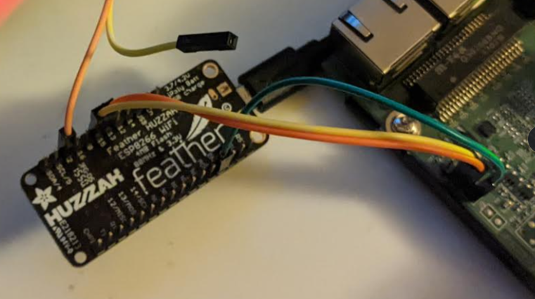
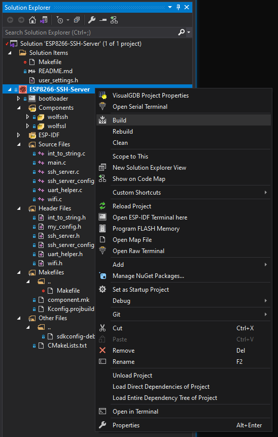

# ESP8266 SSH Server

Connect to Tx/Rx pins on ESP8266 UART via remote SSH.



There's an [ESP-IDF wolfSSH component install](../../ide/Espressif/ESP-IDF/setup_win.bat) for Windows, 
but to get started quickly there's a stale copy of the the components included.

See also the related [ESP-IDF wolfSSL component install](https://github.com/wolfSSL/wolfssl/tree/master/IDE/Espressif/ESP-IDF) for both Windows and bash scripts.

There's also a [blog about ESP8266 UARTs](https://gojimmypi.github.io/SSH-to-ESP8266/) used in this project.

## Requirements

Any ESP8266 with `UART #2` pins available:

`TXD2` = `GPIO 15` = `D8` (Yellow)

and 

`RXD2` = `GPIO 13` = `D7` (Orange)


The [Adafruit Feather HUZZAH ESP8266](https://www.adafruit.com/product/2821) was used during development.

## Private Config

It is usually best to not publish private SSID names and passwords to GitHub. As such the project [Makefile](./Makefile)
looks for one of these files, in this order:

```
# VisualGDB default
/c/workspace/my_private_config.h

# Windows 
/workspace/my_private_config.h

# WSL
/mnt/c/workspace/my_private_config.h

# Linux
~/my_private_config.h
```

If no `my_private_config.h` file is found, default values are used. See [my_config.h](./main/my_config.h)


## Building

The [project](https://github.com/gojimmypi/wolfssh/blob/ESP8266_Development/examples/ESP8266-SSH-Server/ESP8266-SSH-Server.vgdbproj) was developed in Visual Studio with the VisualGDB extension.
Just open the solution file in the [examples/ESP8266-SSH-Server](https://github.com/gojimmypi/wolfssh/tree/ESP8266_Development/examples/ESP8266-SSH-Server) directory. 
Right-click the project and "Build...":



Alternatively, the code can be built via the [RTOS ESP-IDF for ESP8266](https://docs.espressif.com/projects/esp8266-rtos-sdk/en/latest/get-started/index.html)

VisualGDB will typically use the `sdkconfig-debug` (and possibly `sdkconfig-release`), 
but the ESP-IDF commandline will use `sdkconfig`.

## ESP8266 Toolchain

This section is only needed for users not using VisualGDB. Otherwise, see the [VisualGDB Tutorials](https://visualgdb.com/w/tutorials/tag/esp8266/).

Install the latest [ESP8266 Toolchain](https://docs.espressif.com/projects/esp8266-rtos-sdk/en/latest/get-started/windows-setup.html).

To use a dual Windows/Linux (WSL) option, consider a shared directory such as `C:\ESP8288\esp\`
which would be `/mnt/c/ESP8266/esp/` in WSL.

Note there may be an old version of wolfSSL in `ESP8266_RTOS_SDK\components\esp-wolfssl` that should be deleted.

WSL

```bash
export ESP8266_ROOT=/mnt/c/ESP8266
export WORKSPACE=/mnt/c/workspace
```

Linux

```bash
export ESP8266_ROOT=~/ESP8266
export WORKSPACE=~/workspace
```

Then:
```bash

if [ "$ESP8266_ROOT" == "" ]; then read -p "ESP8266_ROOT not set?"; fi
if [ "$WORKSPACE"    == "" ]; then read -p "WORKSPACE not set?"; fi

# create a home directory as needed for the ESP8266_RTOS_SDK
mkdir -p $ESP8266_ROOT/esp/
cd $ESP8266_ROOT/esp/

git clone --recursive https://github.com/espressif/ESP8266_RTOS_SDK.git
export IDF_PATH="$ESP8266_ROOT/esp/ESP8266_RTOS_SDK/"

# Optional section if python pip needs to be installed
# see https://pip.pypa.io/en/stable/installation/
curl --output get-pip.py https://bootstrap.pypa.io/get-pip.py

# or for Python 2.7
# curl --output get-pip27.py https://bootstrap.pypa.io/get-pip.py

# install pip if needed
# ./get-pip.py
#   or
# ./get-pip27.py

# Check if ESP-IDF requirements are met
python -m pip install --user -r $IDF_PATH/requirements.txt

# download the Espressif xtensa compiler
curl --output xtensa-lx106-elf-gcc8_4_0-esp-2020r3-linux-amd64.tar.gz https://dl.espressif.com/dl/xtensa-lx106-elf-gcc8_4_0-esp-2020r3-linux-amd64.tar.gz

# unzip Espressif xtensa compiler
tar -xzf xtensa-lx106-elf-gcc8_4_0-esp-2020r3-linux-amd64.tar.gz

# tell the environment where to find the xtensa compiler
export PATH="$PATH:$ESP8266_ROOT/esp/xtensa-lx106-elf/bin"

# delete the old version of wolfSSL
rm -r ./ESP8266_RTOS_SDK/components/esp-wolfssl

echo # use these line for future ESP-IDF sessions:
echo export IDF_PATH="$ESP8266_ROOT/esp/ESP8266_RTOS_SDK/"
echo export PATH="\$PATH:$ESP8266_ROOT/esp/xtensa-lx106-elf/bin"

```

## Configuration

See the [ssh_server_config.h](./main/ssh_server_config.h) files for various configuration settings.

For private settings (those files with WiFi passords, typically `**/my_private_config.h` excluded in `.gitignore`) 
see [my_config.h](./main/my_config.h).

Both WiFi STA and AP modes are supported. Define `WOLFSSH_SERVER_IS_AP` or `WOLFSSH_SERVER_IS_STA` in
the [ssh_server_config.h](./main/ssh_server_config.h) file.

## Defaults

The default users and passwords are the same as in the [linux server.c example](https://github.com/wolfSSL/wolfssh/blob/8a714b2864e6b5c623da2851af5b5c2d0f9b186b/examples/server/server.c#L412):

User: `jill` password: `upthehill`
User: `jack` password: `fetchapail`

When in AP mode, the demo SSID is `TheBucketHill` and the wifi password is `jackorjill`. 
Unlike the STA mode, where the device needs to get an IP address from DHCP, in AP mode
the IP address is `192.168.4.1`. The computer connecting will likely get an address of `192.168.4.2`.

The default port for this demo is `22222`.

Example to connect from linux:

```
ssh jill@192.168.75.39 -p 22222
```

The SSH Server is current configured for RSA Algorithm. If you've turned that off in favor
or more modern and secure algoritems, you'll need to use something like this until the code
is updated:

```
ssh -o"PubkeyAcceptedAlgorithms +ssh-rsa" -o"HostkeyAlgorithms +ssh-rsa" -p22222 jill@192.168.4.2
```

Linux users note [this resource](http://sensornodeinfo.rockingdlabs.com/blog/2016/01/19/baud74880/) 
may be helpful for connecting at unusual serial port speeds, such 74800 baud:

```bash
git clone https://gist.github.com/3f1a984533556cf890d9.git anybaud
cd anybaud
gcc gistfile.c -o anybaud
anybaud /dev/ttyUSB0 74880
```

## Quick Start

For convenience ONLY, there's a [static copy of wolfSSL components](https://github.com/gojimmypi/wolfssh/tree/ESP8266_Development/examples/Espressif-component-static).

DO NOT USE those static components for anything other than this demo. 
At some point, the code could contain critical, unresolved CVEs that are fixed 
in the current release. To ensure robust security,
install recent code into the Espressif components directory and 
delete your local copy found in `examples/Espressif-component-static`, 
then remove these lines from the [Makefile](./Makefile):

```
EXTRA_COMPONENT_DIRS = ../Espressif-component-static/
CPPFLAGS += -DWOLFSSL_STALE_EXAMPLE=YES
CFLAGS   += -DWOLFSSL_STALE_EXAMPLE=YES
```

WSL Quick Start, use the [ESPPORT](https://github.com/espressif/esp-idf/issues/1026#issuecomment-331307660) with make:

```bash
# change to whatever directory you use for projects

if [ "$WORKSPACE"    == "" ]; then read -p "WORKSPACE not set?"; fi
cd $WORKSPACE

git clone https://github.com/gojimmypi/wolfssh.git
cd ./wolfssh
git checkout ESP8266_Development
cd ./examples/ESP8266-SSH-Server

# Reminder that WSL USB devices are called /dev/ttySn and not /dev/TTYUSBn
# For example, on Windows, COM15 is ttyS15 in WSL.
make flash ESPPORT=/dev/ttyS15

```

## Operational Status

The USB port used to program the device should show only a small amount of text at boot time
before the console output is routed to `UART1`. 

Here is some sample boot text (74800 baud, 8N1):

```
 ets Jan  8 2013,rst cause:2, boot mode:(3,6)

load 0x40100000, len 7288, room 16
tail 8
chksum 0xe4
load 0x3ffe8408, len 24, room 0
tail 8
chksum 0x6d
load 0x3ffe8420, len 3328, room 0
tail 0
chksum 0xab
csum 0xab
```

If everything has gone well, the `Tx` pin of `UART1` (board pin label `2` for `GPIO2`) 
should show a startup message similar to this when pressing the reset button  (74800 baud, 8N1): 

```
ets Jan  8 2013,rst cause:2, boot mode:(3,6)

load 0x40100000, len 7288, room 16
tail 8
chksum 0xe4
load 0x3ffe8408, len 24, room 0
tail 8
chksum 0x6d
load 0x3ffe8420, len 3328, room 0
tail 0
chksum 0xab
csum 0xa
I (44) boot: ESP-IDF v3.4-59-gbbde375b-dirty 2nd stage bootloader
I (45) boot: compile time 19:01:25
I (45) qio_mode: Enabling default flash chip QIO
I (53) boot: SPI Speed      : 40MHz
I (60) boot: SPI Mode       : QIO
I (66) boot: SPI Flash Size : 2MB
I (72) boot: Partition Table:
I (77) boot: ## Label            Usage          Type ST Offset   Length
I (89) boot:  0 nvs              WiFi data        01 02 00009000 00006000
I (100) boot:  1 phy_init         RF data          01 01 0000f000 00001000
I (112) boot:  2 factory          factory app      00 00 00010000 000f0000
I (123) boot: End of partition table
I (130) esp_image: segment 0: paddr=0x00010010 vaddr=0x40210010 size=0x7bfbc (50       7836) map
I (316) esp_image: segment 1: paddr=0x0008bfd4 vaddr=0x4028bfcc size=0x17d40 ( 9       7600) map
I (350) esp_image: segment 2: paddr=0x000a3d1c vaddr=0x3ffe8000 size=0x0070c (         1804) load
I (351) esp_image: segment 3: paddr=0x000a4430 vaddr=0x40100000 size=0x00080 (          128) load
I (362) esp_image: segment 4: paddr=0x000a44b8 vaddr=0x40100080 size=0x05950 ( 2       2864) load
I (382) boot: Loaded app from partition at offset 0x10000
I (407) SSH Server main: Begin main init.
I (408) SSH Server main: wolfSSH debugging on.
I (410) SSH Server main: wolfSSL debugging on.
I (414) wolfssl: Debug ON
I (419) SSH Server main: Begin UART_NUM_0 driver install.
I (429) uart: queue free spaces: 100
I (435) SSH Server main: Done: UART_NUM_0 driver install.
I (444) SSH Server main: Begin uart_enable_swap to UART #2 on pins 13 and 15.
I (456) SSH Server main: Done with uart_enable_swap.
I (465) SSH Server main: Setting up nvs flash for WiFi.
I (474) SSH Server main: Begin setup WiFi STA.
I (483) system_api: Base MAC address is not set, read default base MAC address from EFUSE
I (496) system_api: Base MAC address is not set, read default base MAC address from EFUSE
phy_version: 1167.0, 14a6402, Feb 17 2022, 11:32:25, RTOS new
I (563) phy_init: phy ver: 1167_0
I (581) wifi station: wifi_init_sta finished.
I (704) wifi:state: 0 -> 2 (b0)
I (707) wifi:state: 2 -> 3 (0)
I (710) wifi:state: 3 -> 5 (10)
I (729) wifi:connected with YOURSSID, aid = 1, channel 4, HT20, bssid = YOURMACADDRESS
I (1479) tcpip_adapter: sta ip: 192.168.75.39, mask: 255.255.255.0, gw: 192.168.75.1
I (1482) wifi station: got ip:192.168.75.39
I (1486) wifi station: connected to ap SSID:YOURSSID password:YOURPASSWORD
I (1498) SSH Server main: End setup WiFi STA.
I (1506) wolfssl: sntp_setservername:
I (1512) wolfssl: pool.ntp.org
I (1518) wolfssl: time.nist.gov
I (1524) wolfssl: utcnist.colorado.edu
I (1531) wolfssl: sntp_init done.
I (1537) wolfssl: inet_pton
I (1542) wolfssl: wolfSSL Entering wolfCrypt_Init
I (1551) wolfssl: wolfSSH Server main loop heartbeat!
```

Note in particular the key information after line `I (1479)`:

```
I (729) wifi:connected with YOURSSID, aid = 1, channel 4, HT20, bssid = YOURMACADDRESS
I (1479) tcpip_adapter: sta ip: 192.168.75.39, mask: 255.255.255.0, gw: 192.168.75.1
I (1482) wifi station: got ip:192.168.75.39
I (1486) wifi station: connected to ap SSID:YOURSSID password:YOURPASSWORD
```

The SSH address to use for the connection is Message `I 1482` of this example: `192.168.75.39`

In the case of WiFi AP mode:

```
I (485) SSH Server main: Begin setup WiFi Soft AP.
I (495) system_api: Base MAC address is not set, read default base MAC address from EFUSE
I (508) system_api: Base MAC address is not set, read default base MAC address from EFUSE
phy_version: 1163.0, 665d56c, Jun 24 2020, 10:00:08, RTOS new
I (574) phy_init: phy ver: 1163_0
I (600) wifi station: wifi_init_softap finished. SSID:TheBucketHill password:jackorjill
I (603) SSH Server main: End setup WiFi Soft AP.
```

When the SSH server is running, but nothing interesting is happening, the main thread will continued to periodically
show a message:

```
I (2621868) wolfssl: wolfSSH Server main loop heartbeat!
```

When a new connection is made, there will be some wolfSSL diagnostic messages on the console UART1 (UART #1):
```
I (2662183) wolfssl: server_worker started.
I (2662185) wolfssl: Start NonBlockSSH_accept
I (2662414) wolfssl: wolfSSL Entering GetAlgoId
I (2663406) wolfssl: wolfSSL Entering wc_ecc_shared_secret_gen_sync
I (2664326) wolfssl: wolfSSL Leaving wc_ecc_shared_secret_gen_sync, return 0
I (2664329) wolfssl: wolfSSL Leaving wc_ecc_shared_secret_ex, return 0

```

Once an SSH to UART connection is established, and text sent or received from the target device, the data will
be echoed on the console port (`UART0` = `UART #2`) for example when a carriage return is detected:

```
I (2734282) wolfssl: Tx UART!
I (2736914) wolfssl: UART Send Data
I (2736916) TX_TASK: Wrote 1 bytes
I (2736932) wolfssl: UART Rx Data!
I (2736935) RX_TASK: Read 1 bytes: ''
I (2736942) wolfssl: Tx UART!
```


<br />

## Known Issues

If improper GPIO lines are selected, the UART initialization may hang.

When plugged into a PC that goes to sleep and powers down the USB power, the ESP32 device seems to sometimes crash and does not always recover when PC power resumes.

Only one connection is allowed at the time. There may be a delay when an existing connected is unexpectedly terminated before a new connection can be made.

When only in AP mode, the timeserver settings will not work as there will be no internet connectivity. 
Note that certificates are only valid during a preiod of time.
See the [int set_time()](https://github.com/gojimmypi/wolfssh/blob/893d3787b40b1194fbc7df48c70e01d921cfe01d/examples/ESP8266-SSH-Server/main/main.c#L118)
to hard code a time value.

Different `sdkconfig` files make be used. See above [building](./README.md#Building) notes.

<br />

## Troubleshooting


Although [Error -236](https://github.com/wolfSSL/wolfssl/blob/9b5ad6f218f657d8651a56b50b6db1b3946a811c/wolfssl/wolfcrypt/error-crypt.h#L189) 
typically means "_RNG required but not provided_", the reality is the time is probably wrong.

```
wolfssl: wolfSSL Leaving wc_ecc_shared_secret_gen_sync, return -236
wolfssl: wolfSSL Leaving wc_ecc_shared_secret_ex, return -236
```
If the time is set to a reasonable value, and the `-236` error is still occuring, check the [sdkconfig](https://github.com/gojimmypi/wolfssh/blob/ESP32_Development/examples/ESP32-SSH-Server/sdkconfig) 
file for unexpected changes, such as when using the EDP-IDF menuconfig. When in doubt, revert back to repo version.


A message such as `E (545) uart: uart_set_pin(605): tx_io_num error` typically means the pins assigned to be a UART
Tx/Rx are either input-only or output-only. see [gpio_types.h_](https://github.com/espressif/esp-idf/blob/master/components/hal/include/hal/gpio_types.h)
for example GPIO Pins [34](https://github.com/espressif/esp-idf/blob/3aeb80acb66038f14fc2a7606e7516a3e2bfa6c9/components/hal/include/hal/gpio_types.h#L108)
to 39 are input only.

```
E (545) uart: uart_set_pin(605): tx_io_num error
ESP_ERROR_CHECK failed: esp_err_t 0xffffffff (ESP_FAIL) at 0x400870c4
file: "../main/enc28j60_example_main.c" line 250
func: init_UART
expression: uart_set_pin(UART_NUM_1, TXD_PIN, RXD_PIN, UART_PIN_NO_CHANGE, UART_PIN_NO_CHANGE)

```

If there are a lot of garbage characters on the UART Tx/Rx, ensure the proper baud rate, ground connection, and voltage level match. 
The ESP32 is 3.3V and typically not 5V tolerant. No ground connection will often cause garbage characters on the UART.

The error `serialException: could not open port` typically means that something else is using the COM port on Windows. 
Check for running instances of Putty, etc.

```
  File "C:\SysGCC\esp32\esp-idf\v4.4\python-env\lib\site-packages\serial\serialwin32.py", line 64, in open
    raise SerialException("could not open port {!r}: {!r}".format(self.portstr, ctypes.WinError()))
serial.serialutil.SerialException: could not open port 'COM9': PermissionError(13, 'Access is denied.', None, 5)
```

If you see a messsage `no matching host key type found`:

```
Unable to negotiate with 192.168..4.2 port 22222: no matching host key type found. Their offer: ssh-rsa
```

Try connecting with:

```
ssh -o"PubkeyAcceptedAlgorithms +ssh-rsa" -o"HostkeyAlgorithms +ssh-rsa" -p22222 jill@192.168.4.2

```


<br />

For any technical queries specific to the Espressif chips, you can open an [issue](https://github.com/espressif/esp-idf/issues) on GitHub.

For any issues related to wolfSSL, please open an [issue](https://github.com/wolfssl/wolfssl/issues) on GitHub, 
visit the [wolfSSL support forum](https://www.wolfssl.com/forums/),
send an email to [support](mailto:support@wolfssl.com),   
or [contact us](https://www.wolfssl.com/contact/).

